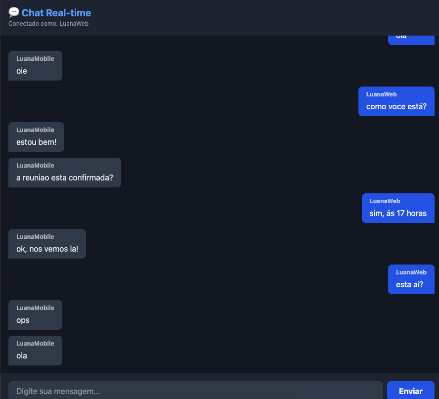
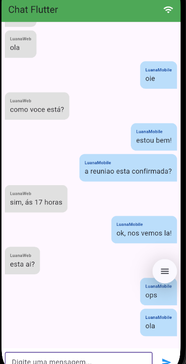

# Chat Real-time Fullstack (Node.js + React + Flutter)

Um sistema de chat em tempo real completo, explorando a arquitetura orientada a eventos com WebSockets e **Offline First** para garantir acesso ao histórico de mensagens mesmo sem conexão com a internet. O projeto demonstra a comunicação bidirecional entre diferentes plataformas (Web e Mobile) com persistência de dados.

## Screenshots

|      Web Client (React)       |     Mobile Client (Flutter)      |
| :---------------------------: | :------------------------------: |
|  |  |

## Funcionalidades Principais

- **Comunicação em Tempo Real:** Envio e recebimento de mensagens instantâneas via WebSockets.
- **Persistência de Dados (Offline First):** As mensagens são salvas localmente utilizando **SQLite (sqflite)**. Ao abrir o app, o histórico é carregado instantaneamente do banco local antes mesmo da conexão com o servidor.
- **Sincronização Inteligente:** O app gerencia IDs locais e IDs remotos para garantir a integridade dos dados entre o dispositivo e o servidor.
- **Gestão de Mensagens:** Possibilidade de apagar mensagens (a ação remove o item tanto do banco local quanto do servidor para todos os usuários).
- **Indicador de Conexão:** Feedback visual na AppBar indicando se o usuário está conectado (Verde) ou desconectado (Vermelho) do servidor Socket.

## 🛠️ Tecnologias Utilizadas

O projeto foi desenvolvido utilizando a estratégia de **Monorepo**, dividido em três camadas principais:

### Backend (API & WebSocket)

- **Node.js & TypeScript:** Base sólida e tipada.
- **Socket.io:** Gerenciamento de eventos de conexão e mensagens em tempo real.
- **Express:** Servidor HTTP.
- **Prisma ORM:** Abstração de banco de dados.
- **SQLite:** Banco de dados relacional (arquivo local).

### Frontend Web

- **React.js + Vite:** SPA rápida e moderna.
- **TailwindCSS:** Estilização utilitária.
- **Socket.io-client:** Cliente para conexão com o backend.
- **Vitest & Testing Library:** Testes unitários e de hooks.

### Mobile App

- **Flutter:** Desenvolvimento híbrido para Android/iOS.
- **Provider:** Gerenciamento de estado (Dependency Injection).
- **Socket_io_client:** Cliente Dart para WebSockets.

---

## Como Funciona a Persistência

O aplicativo utiliza uma estratégia mista de IDs para gerenciar a consistência dos dados:

1. **Local ID:** Gerado automaticamente pelo SQLite do dispositivo. Garante que a mensagem possa ser renderizada e ordenada localmente.
2. **Remote ID:** Gerado pelo servidor (Backend).
3. **Fluxo de Sincronização:**
   - Ao iniciar, o app carrega o cache do SQLite (`getAllMessages`).
   - O Socket conecta e escuta novos eventos.
   - Novas mensagens recebidas são salvas no banco local (`insertMessage`) com o ID remoto mapeado corretamente.
   - Ao apagar uma mensagem, o app utiliza o `remote_id` para solicitar a deleção no servidor e remover do banco local.

## Arquitetura

O sistema segue o padrão de **Event-Driven Architecture**.

1. O Cliente (Web ou Mobile) emite um evento (`send_message`).
2. O Backend escuta, valida e persiste a mensagem no SQLite via Prisma.
3. O Backend emite um evento de broadcast (`receive_message`) para todos os conectados.
